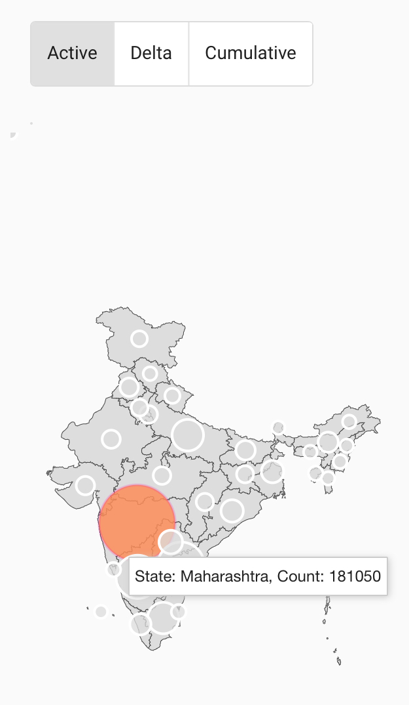
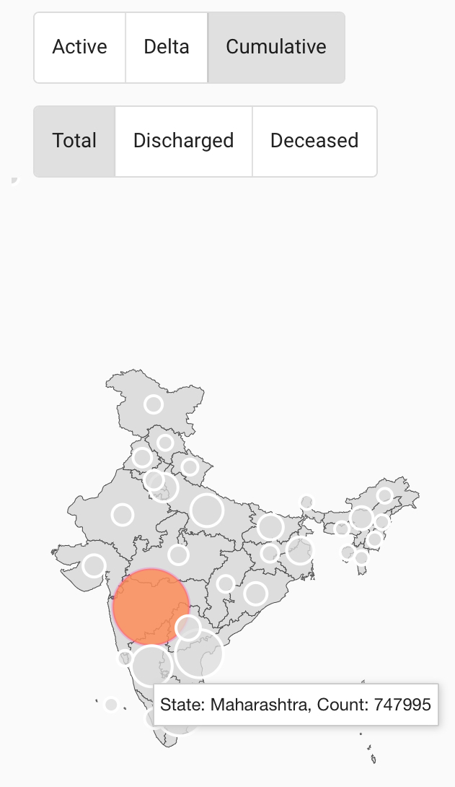
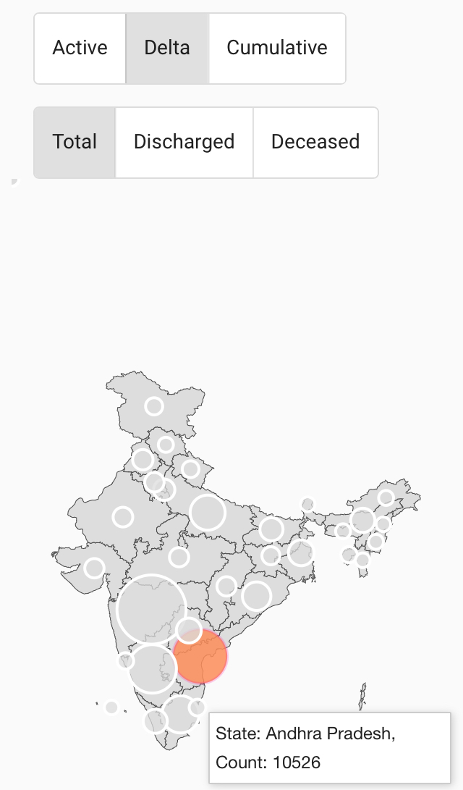

[Covid Stats App](https://covidindiastats.site/)

Data is sourced by scraping the [official site](https://www.mygov.in/covid-19) using open sourced code [Covid Scraper](https://github.com/achanta3215/covid19IndiaScraper)

The code for front-end app is open sourced at [Covid Stats App](https://github.com/achanta3215/covidStatsApp)

Installable as a PWA

**Screenshots**

  
  
  

